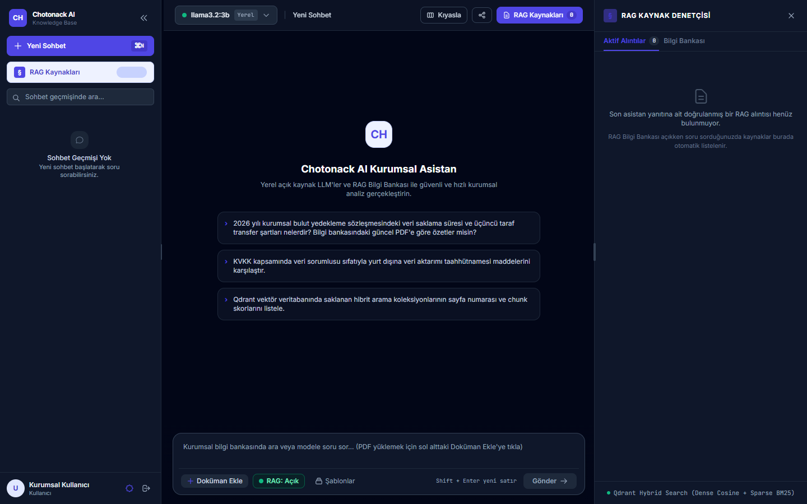
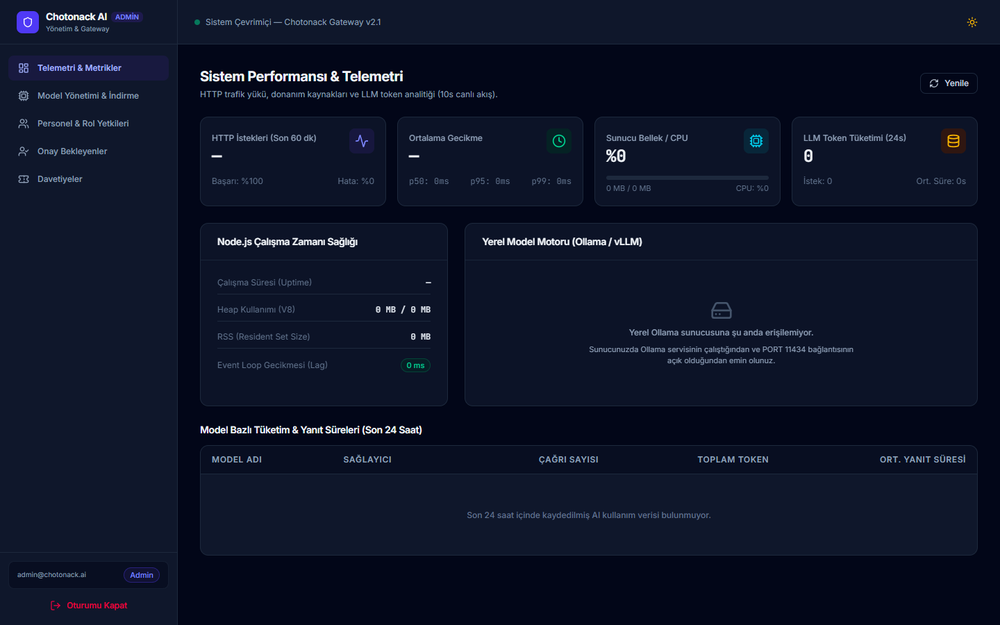

<div align="center">

```
  ██████╗██╗  ██╗ ██████╗ ████████╗ ██████╗ ███╗   ██╗ █████╗  ██████╗██╗  ██╗     █████╗ ██╗
 ██╔════╝██║  ██║██╔═══██╗╚══██╔══╝██╔═══██╗████╗  ██║██╔══██╗██╔════╝██║ ██╔╝    ██╔══██╗██║
 ██║     ███████║██║   ██║   ██║   ██║   ██║██╔██╗ ██║███████║██║     █████═╝     ███████║██║
 ██║     ██╔══██║██║   ██║   ██║   ██║   ██║██║╚██╗██║██╔══██║██║     ██╔═██╗     ██╔══██║██║
 ╚██████╗██║  ██║╚██████╔╝   ██║   ╚██████╔╝██║ ╚████║██║  ██║╚██████╗██║ ╚██╗    ██║  ██║██║
  ╚═════╝╚═╝  ╚═╝ ╚═════╝    ╚═╝    ╚═════╝ ╚═╝  ╚═══╝╚═╝  ╚═╝ ╚═════╝╚═╝  ╚═╝    ╚═╝  ╚═╝╚═╝
```

### 🌰 Enterprise LLM Gateway, Dynamic Knowledge Base & Hardware Observability

*A hardened, privacy-first AI platform uniting local open-source inference and frontier cloud models.*

<br/>

[](https://www.typescriptlang.org/)
[](https://nodejs.org/)
[](https://sdk.vercel.ai/)
[](https://www.mongodb.com/)
[](https://redis.io/)
[](https://qdrant.tech/)
[](https://react.dev/)
[](https://tailwindcss.com/)
[](https://vitest.dev/)
[](#-enterprise--ai-security-architecture)

<br/>

[Key Highlights](#-key-capabilities) •
[Interface Tour](#-interface-showcase) •
[Quickstart](#-quickstart--installation) •
[Security Specs](#-enterprise--ai-security-architecture) •
[Tech Stack](#-monorepo-architecture--technology-stack) •
[API Docs](#-living-documentation--specifications)

---

</div>

## 📖 Executive Overview

Modern enterprises face an escalating dilemma: harnessing the transformative capabilities of Generative AI while strictly preserving data sovereignty, preventing proprietary intellectual property leaks, and avoiding unmanageable infrastructure sprawl. Public AI services inadvertently expose corporate trade secrets, legal contracts, and employee records to external commercial providers. Conversely, disconnected ad-hoc local model deployments lack compliance controls, granular access authorization, and auditable telemetry.

**Chotonack AI** resolves this dichotomy. It is an enterprise-grade, self-hosted LLM Gateway and Knowledge Base Orchestrator designed to be deployed on-premises, within private clouds, or securely accessed over the web. It acts as an auditable control plane between local inference engines (Ollama, vLLM), selective frontier cloud APIs (OpenAI, Anthropic), and corporate data silos.

Engineered as a clean **Modular Monolith**, Chotonack AI coordinates three decoupled systems:
1. **Core Gateway (`apps/backend`):** A high-throughput Node.js/Express service powered by **Vercel AI SDK**, **MongoDB**, **Redis**, and **Qdrant**, managing dynamic 4-tier prompt stacking, BullMQ asynchronous vector ingestion, Qdrant semantic cosine search, and resilient Server-Sent Events (SSE) streaming.
2. **Admin Management Console (`apps/admin-interface`):** A React 19 operator dashboard featuring live CPU/RAM/VRAM telemetry, one-click streaming model pulling with dynamic host storage safety, granular user/role matrices, and cryptographic invitation issuance.
3. **User Workspace (`apps/user-interface`):** A focused workspace delivering grounded AI conversations, split-screen Side-by-Side model benchmarking, traceable citations with an interactive double-tabbed RAG Drawer, and enterprise authentication.

---

## 🖼️ Interface Showcase

*Live application screenshots captured directly from active environments (`localhost:5173` and `localhost:5174`).*

<div align="center">

### 💬 User Workspace & Interactive RAG Drawer
*(Real-time SSE token streaming, verifiable footnotes `[1]`, cosine similarity badges, and dual-tab Knowledge Base Drawer)*



<br/>

### 🛡️ Admin Observability & Hardware Telemetry Console
*(Live CPU/RAM/VRAM telemetry, p50/p95/p99 latency distribution, one-click Ollama pull with host storage guard)*



</div>

---

## ⚡ Quickstart & Installation

Get the entire Chotonack AI ecosystem up and running locally in under 5 minutes.

### 📋 System Prerequisites
- **Node.js:** `v20.0.0+` LTS
- **Package Manager:** `npm` (v10+)
- **Primary Data Stores:**
  - **MongoDB:** `v6.0+` (Application state, chat threads, users, 90-day TTL audit logs)
  - **Redis:** `v7.0+` (Prompt template cache, token revocation blacklist, BullMQ queue, latency buckets)
  - **Qdrant Vector Database:** `v1.8+` (High-dimensional vector storage: `enterprise_knowledge_base`)
- **Inference Engine (Optional for Local Models):**
  - **Ollama:** Running on default port `11434` (`ollama serve`)

---

### Step 1: Clone Repository
```bash
git clone https://github.com/aemreceylan/localAIApp.git
cd localAIApp
```

### Step 2: Configure & Launch Backend Gateway
```bash
cd apps/backend

# Copy environment template and adjust database credentials
cp .env.example .env

# Install dependencies and start development server
npm install
npm run dev
```
- **Backend Service:** `http://localhost:3000`
- **Interactive OpenAPI 3.0 (Swagger UI):** `http://localhost:3000/api/docs`

### Step 3: Launch User Interface
Open a new terminal window:
```bash
cd apps/user-interface
npm install
npm run dev
```
- **User Interface:** `http://localhost:5173`

### Step 4: Launch Admin Console
Open a new terminal window:
```bash
cd apps/admin-interface
npm install
npm run dev
```
- **Admin Management Console:** `http://localhost:5174`

---

### 🔑 Initial Super Admin Onboarding Flow
Chotonack AI requires zero seed passwords or insecure defaults:
1. Navigate to either `http://localhost:5173` or `http://localhost:5174`.
2. On an uninitialized database, the backend automatically detects that no administrator exists and activates the **Super Admin Setup Wizard** (`SetupSuperAdminView`).
3. Configure the primary Super Admin profile and master password.
4. Once completed, public sign-ups are locked into either the **Admin Approval Pool** or restricted to **Cryptographic Invitation Codes**.

---

## 🛡️ Enterprise & AI Security Architecture

Chotonack AI is designed with a defense-in-depth security posture, specifically tailored for enterprise artificial intelligence workloads:

```
┌────────────────────────────────────────────────────────────────────────┐
│               ENTERPRISE PERIMETER & SECURE WEB GATEWAY                │
│                                                                        │
│   Client Request ──► [ Opaque Auth Guard & Redis Instant Revocation ]  │
│                               │                                        │
│   Tier 1 Guardrails ────────► [ Immutable Enterprise Policy Filter ]   │
│                               │                                        │
│   Qdrant Vector DB ─────────► [ Semantic ACL: allowed_roles Filter ]   │
│                               │                                        │
│   Model Engine ─────────────► [ Local Ollama / vLLM / Cloud APIs ]    │
│                               │                                        │
│   LLM Response ─────────────► [ Grounded Citations & Linear Regex ]    │
└────────────────────────────────────────────────────────────────────────┘
```

### 1. Self-Hosted & Web-Accessible Privacy (Zero Data Exfiltration)
Chotonack AI can be deployed within air-gapped corporate intranets, on-premises private infrastructure, or securely exposed over the web via reverse proxies and TLS encryption. When operating with local inference engines (Ollama, vLLM), all prompts, system instructions, document embeddings, and model responses remain strictly within your host infrastructure. No telemetry heartbeats, conversational payloads, or token streams are ever transmitted to third-party AI providers.

### 2. Strict Prompt Injection Mitigation & Non-Bypassable Guardrails
Chotonack AI prevents prompt injection and persona hijacking through its **4-Tier Dynamic Prompt Stacking** architecture. The highest tier—**Organization Security Guardrail**—is enforced by the backend compiler at the system level. User prompts, custom instructions, or conversational history cannot override, alter, or bypass organization-level guardrails.

### 3. Vector Database ACL & Semantic Boundary Defense
RAG operations enforce strict identity checks directly inside vector payloads (`allowed_roles`). During vector similarity searches in **Qdrant**, tenant and role filters are applied at query time. Even if an unauthorized user crafts a semantically targeted query toward restricted corporate data (*e.g., HR executive payrolls or confidential legal memos*), the vector database mathematically rejects the chunk before retrieval occurs.

### 4. Grounded RAG & Hallucination Defense
To eliminate generative hallucinations:
- Embeddings are filtered through dynamic cosine similarity thresholds.
- Responses reference specific vector chunks with interactive footnotes (`[1]`, `[2]`).
- The **RAG Drawer** cross-examines citations against exact document names, chunk indexes, and raw text snippets, providing auditable source verification.

### 5. Dual-Token Authentication & Instant Revocation Engine
- Sessions use cryptographically signed opaque tokens paired with `HttpOnly`, `SameSite=Strict`, and `Secure` cookies (`nexus_session`, `admin_token`), mitigating XSS and CSRF attack vectors.
- A high-throughput **Redis** revocation blacklist intercepts every incoming request. Disabling a compromised account or modifying permissions immediately severs active Server-Sent Events (SSE) token streams in real time.

### 6. BOLA / IDOR Object-Level Protection
All conversation IDs, document uploads, and vector search namespaces are verified against authenticated user IDs and assigned role scopes at the repository layer. Direct object manipulation or cross-session thread inspection is structurally impossible.

### 7. Host Integrity: Dynamic Storage & Disk Safety Guard
To prevent host denial-of-service (DoS) conditions caused by storage exhaustion when downloading massive open-source model weights (e.g., 70B parameter models), the Model Manager executes automated pre-flight and runtime disk capacity evaluations (`POST /api/admin/models/pull`). The safety threshold is dynamically configurable by the Administrator, automatically aborting incoming model pulls whenever available disk capacity approaches critical operational limits.

### 8. ReDoS-Safe Text Processing & Sanitized Inputs
Citation snippet matching and document ingestion utilize linear-time, sanitized regular expressions that resist Regular Expression Denial of Service (ReDoS) exploits. All request payloads are strictly validated using comprehensive Zod schemas.

### 9. Provider-Agnostic LLM Architecture & Decoupled Model Routing
Chotonack AI avoids single-vendor lock-in by completely decoupling the platform logic from underlying model weights. The system natively accommodates any local open-source LLM running via Ollama/vLLM (such as Llama, Mistral, Qwen, DeepSeek, Phi, Gemma) alongside frontier cloud providers (OpenAI, Anthropic). Zero model identifiers, vendor fallbacks, or inference URLs are hardcoded into the source code, database schemas, or environment files. All model allocations, default selections, and department access boundaries are dynamically provisioned and updated in real time via the Admin Console.

---

## 🚀 Key Capabilities

### ⚡ Powered by Vercel AI SDK
Chotonack AI leverages the **Vercel AI SDK** as its unified generative AI runtime layer:
- **Provider Agnostic:** Standardized protocol handling local models (via `ollama-ai-provider`) and cloud APIs (OpenAI, Anthropic).
- **DataStream Protocol:** High-performance Server-Sent Events (SSE) with structured streaming for text tokens, custom RAG citation metadata payloads, and abort signals.
- **Robust Error Recovery:** Built-in backoff strategies and clean stream termination handling.

### 🗄️ Resilient Data Layer: MongoDB, Redis & Qdrant
- **MongoDB:** Structured operational data, message threads, dynamic RBAC permission catalogs, and high-performance **90-day automated TTL audit logs** for compliance and token accounting.
- **Redis:** High-speed in-memory engine powering **sub-millisecond Read-Through prompt caching**, the **BullMQ** ingestion job queue, real-time session revocation blacklists, and sliding-window latency telemetry buckets.
- **Qdrant:** Industrial vector database handling dense embeddings, high-dimensional cosine distance metrics, and metadata payload filtering for granular role-based document access.

### 👥 Granular Enterprise RBAC & Dynamic Inheritance
- **Base Archetypes (`Admin`, `User`):** Foundational root templates ensuring baseline security compliance.
- **Derived Departmental Roles:** Create custom specialized roles (*e.g., Legal Counsel, Financial Analyst, HR Partner*) inheriting baseline archetypes with custom access rights.
- **User-Level Permission Overrides:** Dynamically expand or restrict privileges for individual users without creating cluttering global roles.
- **Document-Level Access Control (ACL):** Bind corporate documents to specific role vectors during ingestion.

### 🎭 4-Tier Dynamic Prompt Stacking
Every chat prompt is compiled in real time by layering four distinct contexts:
1. **Tier 1 (Enterprise Guardrail):** Corporate safety, legal compliance, and non-negotiable boundaries.
2. **Tier 2 (Specialized Persona):** System-level operational expertise (*e.g., Senior TypeScript Architect, Turkish Legal Advisor*).
3. **Tier 3 (User Custom Instructions):** User-specific output formatting, preferred structure, and tonal adjustments.
4. **Tier 4 (Runtime User Query):** User request enriched with semantically retrieved knowledge chunks.
*All templates are cached via Redis Read-Through; admin-side prompt updates apply immediately on the next message without service restarts.*

### 📚 Production-Grade RAG Engine
- **Asynchronous Ingestion Pipeline:** High-capacity PDF and document processing powered by **BullMQ** worker queues.
- **Qdrant Vector Database:** Sub-millisecond dense vector similarity searches with cosine distance scoring.
- **Double-Tabbed RAG Drawer:** Users can seamlessly toggle between **Active Citations** (chunks supporting the current response) and **Knowledge Base Documents** (toggling specific corporate libraries on or off).

### ⚔️ Side-by-Side Model Comparison Arena
Directly evaluate and compare model quality: send identical prompts simultaneously to two different LLMs (e.g., a local Llama 3 model vs. a cloud-based model) in a synchronized split-screen view with independent latency and token tracking.

### 🎟️ Dual Onboarding Channels
- **Cryptographic Invitations:** Generate time-limited, quota-constrained registration tokens (`nx_inv_*`) with pre-assigned roles.
- **Open Registration + Admin Approval Pool:** Public registrations are placed in a quarantined `pending_approval` state until reviewed, assigned a role, and approved by an administrator.

### 📊 Real-Time Hardware Telemetry & Observability
- **Request Latency Distribution:** Real-time Redis minute buckets tracking p50, p95, and p99 response times.
- **System Metrics:** Live monitoring of CPU utilization, RAM usage, Event Loop Lag, and Ollama GPU VRAM allocation.
- **Comprehensive Audit Trails:** 90-day automated TTL retention in MongoDB documenting token consumption by user, role, and model.

### 📦 Dynamic Model Operations
Admin-driven model lifecycle management: trigger asynchronous pulls from Ollama registries with SSE download progress, assign platform-wide default models, and safely purge unused model weights.

---

## 🏗️ Monorepo Architecture & Technology Stack

Chotonack AI uses a structured monorepo design with strict bounded contexts:

```
localAIApp/
├── apps/
│   ├── backend/             # Node.js 20, Express 5, TypeScript, Modular Monolith
│   │   └── src/modules/
│   │       ├── auth/        # Authentication, session tokens, user lifecycle
│   │       ├── role/        # Dynamic RBAC, permission overrides, archetype engine
│   │       ├── chat/        # Multi-model sessions, SSE streaming, Vercel AI SDK
│   │       ├── prompt/      # 4-tier prompt stacking & Redis caching
│   │       ├── rag/         # BullMQ queue, Qdrant vector adapter, PDF parsing
│   │       ├── ai/          # Model management, SSE model pulling, disk guard
│   │       └── telemetry/   # Latency buckets, system hardware metrics, audit logs
│   ├── admin-interface/     # React 19, React Compiler, Tailwind CSS v4, Vite 7
│   └── user-interface/      # React 18, Tailwind CSS, Vite, SSE Stream Client
├── documents/               # Master Knowledge Base, PRD, and OpenAPI 3.0 Specs
└── docs/assets/screenshots/ # High-resolution interface captures
```

| Layer | Technologies | Architectural Highlights |
| :--- | :--- | :--- |
| **Backend Gateway** | Node.js 20+, Express 5, TypeScript, Mongoose, Qdrant, BullMQ, Redis, Vercel AI SDK, Vitest | Native ESM subpath imports (`#*`), Zod DTO contracts, zero cross-module DB leakage. |
| **Admin Console** | React 19, React Compiler, Tailwind CSS v4, TanStack Query v5, Vite 7 | CSS-first `@theme`, automatic memoization, responsive data tables, live telemetry cards. |
| **User Interface** | React, Tailwind CSS, Vite, Lucide Icons | Smooth SSE stream rendering, collapsible sidebar, floating prompt dock, RAG drawer. |
| **Data & Storage** | MongoDB, Redis, Qdrant | Micro-buffered telemetry, persistent vector collections, BullMQ queues. |
| **AI Orchestration**| Vercel AI SDK, Ollama | Provider-agnostic model routing, DataStream protocol, streaming completions. |

---

## 📚 Living Documentation & Specifications

- **Interactive OpenAPI 3.0 Specification:** Real-time Swagger UI at `http://localhost:3000/api/docs`.
- **Master API Schema:** Live JSON contract maintained at [`documents/openapi.json`](documents/openapi.json).
- **Product Requirements Document (PRD v2.1.0):** [`documents/common/prd.md`](documents/common/prd.md).
- **Data & Business Workflows (ERD & Sequences):** [`documents/common/data_and_business_workflows.md`](documents/common/data_and_business_workflows.md).
- **Backend Architecture (SAD v1.2.0):** [`documents/backend/architecture.md`](documents/backend/architecture.md).

---

## 🧪 Testing & Quality Assurance

The backend includes a comprehensive Vitest suite covering domain models, RBAC authorization, telemetry aggregation, and vector adapters:

```bash
cd apps/backend
npm run test
```
> **149 tests passing across 22 test suites with 100% success rate.**

---

## 📄 License

Distributed under the **MIT License**. See `LICENSE` for details.
