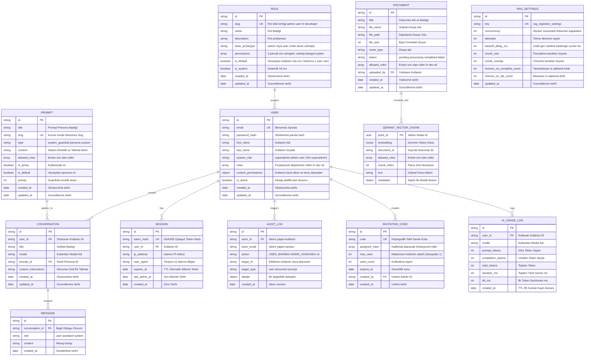
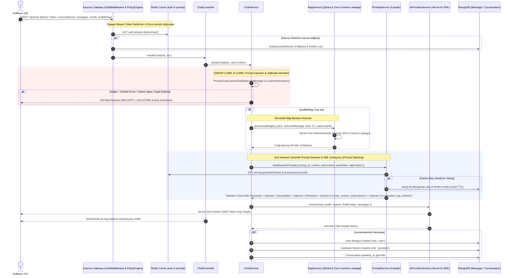
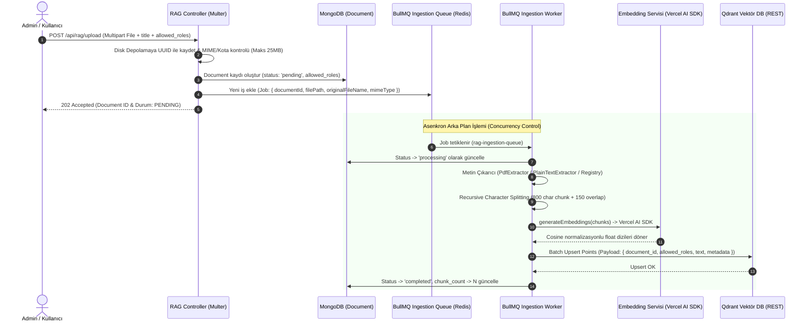
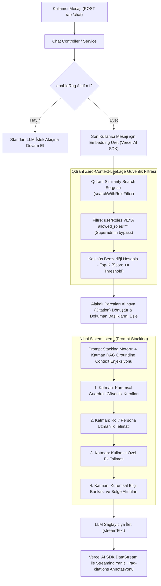
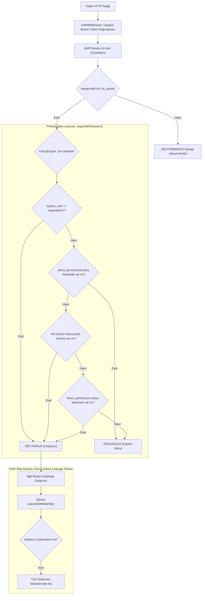

# VERİTABANI MİMARİSİ, VARLIK İLİŞKİLERİ (ERD) VE İŞ MANTIĞI ÇALIŞMA ŞEMALARI

> **DOKÜMAN TİPİ:** Ortak Veritabanı ve İş Akışları Referansı (Tüm Monorepo: `backend`, `admin-interface`, `user-interface`)  
> **Proje:** Kurumsal LLM & Veri Yönetim Platformu (_Chotonack AI — Gateway & Knowledge Base_)  
> **Doküman:** Veritabanı ve İş Mantığı Çalışma Şemaları (Data & Business Architecture Specification)  
> **Sürüm:** v1.0.0  
> **Tarih:** Eylül 2026  
> **Hedef Kitle:** Yazılım Mimarları, Backend/Frontend Geliştiricileri ve AI Kodlama Ajanları

---

## 1. Giriş ve Hibrit Veri Mimarisi Vizyonu

Platform, kurumsal güvenlik ve yüksek ölçeklenebilirlik gereksinimlerini karşılamak amacıyla **3 katmanlı hibrit bir veri mimarisi** üzerine inşa edilmiştir:

1. **İlişkisel/Operasyonel Doküman Katmanı (MongoDB & Mongoose):**  
   Kullanıcılar (`users`), oturumlar (`sessions`), dinamik roller (`roles`), 4 katmanlı promptlar (`prompts`), sohbet geçmişi (`conversations`, `messages`), doküman üst verileri (`documents`) ve kuyruk ayarları (`rag_configs`) Mongoose şemaları altında tutulur. Veri erişimi **Enterprise RBAC**, **Document ACL** (`allowed_roles`) ve kullanıcı bazlı sahiplik (`user_id`) ile izole edilir.
2. **Vektörel Arama ve Bilgi Bankası Katmanı (Qdrant Dedicated Vector DB):**  
   RAG dokümanlarından elde edilen metin parçacıklarının (chunks) vektör gömmeleri (embeddings) Qdrant üzerinde saklanır. Rol bazlı kurumsal veri izolasyonu (**Zero-Context-Leakage**), Qdrant payload filtreleri (`allowed_roles`) üzerinden matematiksel olarak garanti edilir.
3. **Asenkron İş Kuyruğu, Dağıtık Önbellek ve Durum Katmanı (BullMQ & Redis):**  
   - **Dağıtık Oturum Önbellekleme:** Opaque Bearer token doğrulamaları Redis üzerinden alt-milisaniye hızında (`auth:session:${tokenHash}`) çözümlenir; veritabanı yazma yükü `last_active_at` güncellemesinin 5 dakikada bire kısıtlanmasıyla (throttling) %99'un üzerinde azaltılır. Ban ve yetki değişikliklerinde oturum anahtarları Redis'ten anında düşürülür (Zero-Token-Leakage).
   - **Dinamik Prompt Stacking Önbelleği:** Sistem promptları ve guardrail kuralları Redis Read-Through önbelleği (`prompt:guardrail:${rolesKey}`, `prompt:persona:id:${id}`) ile <1ms sürede derlenir. Prompt ekleme, güncelleme veya silme işlemlerinde `cacheService.delPattern('prompt:*')` ile Redis önbelleği anında geçersizleştirilir (anında yürürlüğe girme garantisi).
   - **Dinamik Çalışma Ayarları & Kuyruk Yönetimi:** RAG çalışma ayarları (`config:rag:runtime`) Redis üzerinden hot-reload edilir; doküman parçalama ve embedding çıkarma işleri BullMQ kuyrukları (`rag-ingestion-queue`) ile yönetilir. Bull-Board gösterge paneli ile anlık kuyruk izleme sağlanır.

---

## 2. Bütünleşik Varlık İlişkileri Şeması (Entity Relationship Diagram - ERD)

Aşağıdaki şemada, MongoDB üzerindeki temel koleksiyonlar, aralarındaki 1-N ve referans ilişkileri ile Qdrant vektör koleksiyonunun ilişkisi gösterilmiştir:



---

## 3. Koleksiyon Şemaları ve Veri Sözlüğü (Data Dictionary)

### 3.1. `roles` (Kurumsal Rol ve Yetki Şeması)

Open/Closed prensibine uygun, arketip tabanlı tavan havuzu (`admin` veya `user`) ile korunan dinamik rol tanımları.

| Alan Adı                    | Tip           | Zorunlu? | Varsayılan | İndeks | Açıklama                                                                |
| :-------------------------- | :------------ | :------: | :--------: | :----: | :---------------------------------------------------------------------- |
| `_id`                       | ObjectId      |   Evet   |    auto    |   PK   | Rol benzersiz kimliği                                                   |
| `slug`                      | String (50)   |   Evet   |     -      | UNIQUE | Rol sistemik kodu (`system_admin`, `default_user`, `hr`, `developer`)   |
| `name`                      | String (100)  |   Evet   |     -      |   -    | Rolün görünen adı                                                       |
| `description`               | String        |  Hayır   |    `""`    |   -    | Rol tanımı ve sorumluluk alanı                                          |
| `base_archetype`            | String        |   Evet   |  `'user'`  | Index  | Ana rol arketipi (`'admin'`, `'user'`). Yetki tavanını belirler.        |
| `permissions`               | Array[String] |   Evet   |    `[]`    |   -    | 3 parçalı izinler (`admin:user:ban`, `user:chat:create`)                 |
| `is_default`                | Boolean       |   Evet   |  `false`   | Partial Unique | Yeni kullanıcılar için varsayılan rol mü? (Yalnızca 1 user rolü) |
| `is_system`                 | Boolean       |   Evet   |  `false`   |   -    | Sistemik rol (silinemez)                                                |
| `created_at` / `updated_at` | Date          |   Evet   |    auto    |   -    | Zaman damgaları                                                         |

---

### 3.2. `users` (Kullanıcılar ve RBAC)

Sistemde oturum açan personeller.

| Alan Adı             | Tip               | Zorunlu? | Varsayılan | İndeks                         | Açıklama                                                     |
| :------------------- | :---------------- | :------: | :--------: | :----------------------------- | :----------------------------------------------------------- |
| `_id`                | ObjectId          |   Evet   |    auto    | PK                             | Kullanıcı kimliği                                            |
| `email`              | String            |   Evet   |     -      | UNIQUE                         | E-posta adresi                                               |
| `password_hash`      | String            |   Evet   |     -      | -                              | Şifrelenmiş parola özeti                                     |
| `first_name`         | String            |   Evet   |     -      | -                              | Adı                                                          |
| `last_name`          | String            |   Evet   |     -      | -                              | Soyadı                                                       |
| `system_role`        | String            |   Evet   |  `'user'`  | Partial Unique (`superadmin`)  | `'superadmin'`, `'admin'`, `'user'` (Root Dokunulmazlığı)    |
| `roles`              | Array[String]     |   Evet   |    `[]`    | Index                          | Fonksiyonel departman rolleri (`['hr']`, `['developer']`)    |
| `custom_permissions` | Object            |  Hayır   | `{allow:[], deny:[]}` | -                   | Kullanıcı spesifik yetki ezme (İstisnai allow ve deny)       |
| `is_active`          | Boolean           |   Evet   |   `true`   | Index                          | Hesap aktiflik durumu (Ban kontrolü)                         |

---

### 3.2.1. `sessions` (Kullanıcı Oturumları & Opaque Bearer Tokens - Redis Destekli)

Kullanıcıların aktif oturumlarını ve anlık ban/yetki iptalini yöneten veritabanı oturum koleksiyonu. Performans için token doğrulamaları Redis (`auth:session:${tokenHash}`) üzerinden sub-millisecond yanıtlanır; oturum son aktivite (`last_active_at`) veritabanı yazımları 5 dakikalık zaman aralığına kısıtlanarak (throttling) I/O yükü minimize edilir. Kullanıcı banlandığında veya rol/yetkileri değiştiğinde oturum anahtarları Redis'ten anında temizlenir.

| Alan Adı         | Tip               | Zorunlu? | Varsayılan | İndeks                             | Açıklama                                              |
| :--------------- | :---------------- | :------: | :--------: | :--------------------------------- | :---------------------------------------------------- |
| `_id`            | ObjectId          |   Evet   |    auto    | PK                                 | Oturum benzersiz kimliği                              |
| `token_hash`     | String (64 hex)   |   Evet   |     -      | UNIQUE                             | Opaque Bearer Token'ın SHA-256 kriptografik özeti     |
| `user_id`        | ObjectId          |   Evet   |     -      | Index                              | Oturumu açan kullanıcı kimliği                        |
| `ip_address`     | String            |  Hayır   |     -      | -                                  | Oturum açılan istemci IP adresi                       |
| `user_agent`     | String            |  Hayır   |     -      | -                                  | İstemci tarayıcı ve platform başlığı                  |
| `expires_at`     | Date              |   Evet   |   +7 gün   | TTL Index (`expireAfterSeconds: 0`) | Süresi dolan oturumları MongoDB otomatik siler        |
| `last_active_at` | Date              |   Evet   |    auto    | -                                  | Son HTTP isteği zaman damgası (5 dk throttled)        |
| `created_at`     | Date              |   Evet   |    auto    | -                                  | Oturum başlangıç zamanı                               |

---

### 3.3. `prompts` (Dinamik Prompt Stacking Motoru & Redis Read-Through Önbellekleme)

Promptlar veritabanından her mesajda tekrar tekrar derlenmez; kurumsal güvenlik kuralları ve rol personaları Redis Read-Through önbelleği ile sub-millisecond sürede yanıtlanır.

- **Bileşik İndeks (Compound Index):** `{ type: 1, is_active: 1, priority: 1 }` (Kapsamlı MongoDB taraması engellenir, index-only sorgulama).
- **Redis Önbellek Anahtarları:**
  - Guardrail kuralları: `prompt:guardrail:${rolesKey}`
  - Özel Persona: `prompt:persona:id:${id}`
  - Varsayılan Persona: `prompt:persona:default:${rolesKey}`
- **Anında Geçersizleştirme (Instant Cache Invalidation):** Prompt ekleme (`POST`), güncelleme (`PUT`) veya silme (`DELETE`) işlemlerinde `cacheService.delPattern('prompt:*')` otomatik tetiklenir; sistem genelindeki tüm prompt önbellekleri silinir ve ilk istekte güncel veritabanı içeriği derlenir (Kural 6 & Kural 9 uyumu).

| Alan Adı        | Tip           | Zorunlu? | Varsayılan  | İndeks                                            | Açıklama                                           |
| :-------------- | :------------ | :------: | :---------: | :------------------------------------------------ | :------------------------------------------------- |
| `_id`           | ObjectId      |   Evet   |    auto     | PK                                                | Prompt kimliği                                     |
| `title`         | String (150)  |   Evet   |      -      | -                                                 | Başlık (Örn: "KVKK & Finansal Güvenlik Guardrail") |
| `slug`          | String        |   Evet   |      -      | UNIQUE                                            | Kod içi ve API erişim slug'ı                       |
| `type`          | String        |   Evet   | `'persona'` | Compound (`type` + `is_active` + `priority`)     | `'system_guardrail'`, `'persona'`, `'custom'`      |
| `content`       | String        |   Evet   |      -      | -                                                 | LLM'e enjekte edilecek gerçek talimat              |
| `allowed_roles` | Array[String] |   Evet   |  `['*']`    | Index                                             | Erişebilecek roller (`['*']`, `['hr']` vb.)        |
| `is_active`     | Boolean       |   Evet   |   `true`    | Compound Index parçası                            | Aktiflik anahtarı                                  |
| `is_default`    | Boolean       |   Evet   |   `false`   | -                                                 | Kurum için varsayılan persona mı?                  |
| `priority`      | Number        |   Evet   |     `0`     | Compound Index parçası                            | Guardrail birleştirme öncelik sırası               |

---

### 3.4. `conversations` (Sohbet Oturumları)

| Alan Adı              | Tip           | Zorunlu? | Varsayılan    | İndeks                       | Açıklama                                               |
| :-------------------- | :------------ | :------: | :-----------: | :--------------------------- | :----------------------------------------------------- |
| `_id`                 | ObjectId      |   Evet   |     auto      | PK                           | Oturum kimliği                                         |
| `user_id`             | ObjectId      |  Hayır   |       -       | Compound (`user_id` + `updated_at`) | Oturumu başlatan kullanıcı (Özel veri sahipliği)       |
| `title`               | String (200)  |   Evet   | 'Yeni Sohbet' | -                            | Sohbet başlığı                                         |
| `model`               | String        |   Evet   |       -       | -                            | Oturumda seçilen LLM kimliği (Zorunlu)                 |
| `prompt_id`           | ObjectId      |  Hayır   |    `null`     | -                            | Bağlı olduğu persona ID                                |
| `custom_instructions` | String (2000) |  Hayır   |    `null`     | -                            | Oturuma özel kullanıcı ek talimatı                     |
| `created_at`          | Date          |   Evet   |     auto      | -                            | Oluşturulma tarihi                                     |
| `updated_at`          | Date          |   Evet   |     auto      | Index                        | Son aktivite tarihi                                    |

---

### 3.5. `messages` (Sohbet Mesajları)

| Alan Adı          | Tip      | Zorunlu? | Varsayılan | İndeks                                      | Açıklama                                |
| :---------------- | :------- | :------: | :--------: | :------------------------------------------ | :-------------------------------------- |
| `_id`             | ObjectId |   Evet   |    auto    | PK                                          | Mesaj kimliği                           |
| `conversation_id` | ObjectId |   Evet   |     -      | Compound (`conversation_id` + `created_at`) | Bağlı olduğu oturum                     |
| `role`            | String   |   Evet   |     -      | -                                           | `'user'`, `'assistant'`, `'system'`     |
| `content`         | String   |   Evet   |     -      | -                                           | Mesaj içeriği (Markdown destekli metin) |
| `created_at`      | Date     |   Evet   |    auto    | -                                           | Mesaj zaman damgası                     |

---

### 3.6. `documents` (RAG Bilgi Bankası Üst Verileri & Document ACL)

Kurumsal dokümanların üst verileri, işlenme durumu ve rol bazlı erişim izinleri (Document ACL).

| Alan Adı        | Tip           | Zorunlu? | Varsayılan  | İndeks                | Açıklama                                               |
| :-------------- | :------------ | :------: | :---------: | :-------------------- | :----------------------------------------------------- |
| `_id`           | ObjectId      |   Evet   |    auto     | PK                    | Doküman kimliği                                        |
| `title`         | String (200)  |   Evet   |      -      | -                     | Doküman başlığı                                        |
| `file_name`     | String        |   Evet   |      -      | -                     | Orijinal dosya adı (UUID ile güvenli saklanır)         |
| `file_path`     | String        |   Evet   |      -      | -                     | Sunucu yerel depolama dosya yolu (`uploads/rag/`)      |
| `file_size`     | Number        |   Evet   |      -      | -                     | Bayt cinsinden dosya boyutu (Maks 25MB)                |
| `mime_type`     | String        |   Evet   |      -      | -                     | `application/pdf`, `text/plain`, `text/markdown` vb.   |
| `status`        | String        |   Evet   | `'pending'` | Index                 | `'pending'`, `'processing'`, `'completed'`, `'failed'` |
| `chunk_count`   | Number        |   Evet   |     `0`     | -                     | Qdrant'a yazılan vektör parçacığı adedi                |
| `allowed_roles` | Array[String] |   Evet   |  `['*']`    | Compound (`allowed_roles` + `created_at`) | Belgeyi sorgulayabilecek roller (`['*']`, `['hr']` vb.)|
| `uploaded_by`   | ObjectId      |  Hayır   |      -      | Index                                     | Dokümanı yükleyen kullanıcı kimliği (`users._id`)      |
| `error_message` | String        |  Hayır   |   `null`    | -                                         | İşleme başarısız olursa yakalanan hata mesajı          |
| `created_at`    | Date          |   Evet   |    auto     | Compound Index parçası                    | Yüklenme zaman damgası                                 |
| `updated_at`    | Date          |   Evet   |    auto     | -                     | Son güncelleme zaman damgası                           |

---

### 3.7. Qdrant Vektör Koleksiyonu Şeması (`rag_documents_vectors`)

Qdrant üzerinde her vektör kaydı bir `Point` nesnesidir ve Zero-Context-Leakage prensibiyle filtrelenir:

- **Point ID:** UUIDv4 formatında benzersiz parça kimliği.
- **Vector:** Model embedding çıktısı (örn: 1536 veya 768 float değerleri).
- **Payload (Filtrelenebilir Meta Veri):**
  ```json
  {
    "document_id": "66f91a2b8e3a...",
    "allowed_roles": ["hr", "finance"],
    "chunk_index": 4,
    "text": "Kurumumuz bünyesinde veri güvenliği ve yıllık izin devir şartları...",
    "metadata": {
      "filename": "ik_el_kitabi_2026.pdf",
      "page_number": 12,
      "chunk_char_count": 450
    }
  }
  ```

---

### 3.8. `rag_configs` (Dinamik BullMQ & Ingestion Ayarları - Hot-Reload)

Sistem yöneticisinin backend'i yeniden başlatmadan BullMQ iş kuyruğu parametrelerini anlık güncelleyebilmesini sağlayan ayar tablosu (`key: 'rag_ingestion_settings'`).

| Alan Adı                   | Tip      | Zorunlu? | Varsayılan | İndeks | Açıklama                                                  |
| :------------------------- | :------- | :------: | :--------: | :----: | :-------------------------------------------------------- |
| `_id`                      | ObjectId |   Evet   |    auto    |   PK   | Kayıt kimliği                                             |
| `key`                      | String   |   Evet   |    auto    | UNIQUE | Tekil ayar anahtarı (`'rag_ingestion_settings'`)          |
| `concurrency`              | Number   |   Evet   |    `2`     |   -    | BullMQ Worker anlık eşzamanlı doküman işleme kapasitesi   |
| `attempts`                 | Number   |   Evet   |    `3`     |   -    | Başarısız olan doküman indeksleme işlerinin tekrar sayısı |
| `backoff_delay_ms`         | Number   |   Evet   |   `2000`   |   -    | Üstel geri çekilme (exponential backoff) başlangıç süresi |
| `chunk_size`               | Number   |   Evet   |   `800`    |   -    | Metin parçalama (chunking) karakter hedef boyutu          |
| `remove_on_complete_count` | Number   |   Evet   |   `1000`   |   -    | Başarıyla tamamlanan işlerin Redis'te saklanma limiti     |
| `remove_on_fail_count`     | Number   |   Evet   |   `5000`   |   -    | Hata alan işlerin Redis'te saklanma limiti                |
| `updated_at`               | Date     |   Evet   |    auto    |   -    | Son güncelleme tarihi                                     |

---

## 4. İş Mantığı ve Çalışma Akış Şemaları (Workflows & Sequences)

### 4.1. Akış 1: LLM Mesaj Gönderimi & Dinamik Prompt Stacking Akışı

Kullanıcı bir mesaj gönderdiğinde sistemin yanıt üretme, güvenlik guardrail'lerini uygulama, RAG grounding ve veritabanına yazma sırası:



---

### 4.2. Akış 2: RAG Doküman Yükleme ve Asenkron İşleme Pipeline'ı (Ingestion)

Yüksek boyutlu kurumsal dokümanların ana HTTP thread'ini bloke etmeden BullMQ worker'ları ve Qdrant ile işlenmesi:



---

### 4.3. Akış 3: RAG Destekli Chat Arama ve Yanıt Üretimi (Retrieval Flow & Grounding)

Kullanıcı RAG aramasını aktif ederek (`enableRag: true`) bir soru sorduğunda Qdrant, Zero-Context-Leakage ve LLM entegrasyonu:



---

### 4.4. Akış 4: Kurumsal RBAC, Policy Engine & Zero-Context-Leakage Karar Akışı

Gelen her isteğin yetkisiz departman veya kullanıcı verilerine erişmesini engelleyen güvenlik akışı:



---

## 5. Modüler Monolit Facade ve İletişim Standartları

[AGENTS.md](../../AGENTS.md) 3. kuralı uyarınca: **Modüller birbirlerinin veritabanı modellerini doğrudan import edemez.** Modüller arası tüm etkileşim yalnızca modülün kökündeki `index.ts` üzerinden yürütülür.

### Modül İletişim Arayüzleri Tablosu

| İsteyen Modül | Hedef Modül | İzin Verilen Facade Metodu / Event                                              | Gerekçe / Kullanım Amacı                                       |
| :------------ | :---------- | :------------------------------------------------------------------------------ | :------------------------------------------------------------- |
| `chat`        | `prompt`    | `promptService.buildSystemPrompt({ prompt_id, custom_instructions, userRoles, ragContext })` | Çok katmanlı (4 katman) promptu anlık derlemek                 |
| `chat`        | `auth`      | `authMiddleware` / `IUser`                                                      | Kullanıcının aktifliğini ve rol/yetki matrisini denetlemek     |
| `chat`        | `ai`        | `streamText({ model, messages, system })` / `getModel(selectedModel)`           | LLM çıkarımını başlatmak                                       |
| `chat`        | `rag`       | `ragService.queryKnowledge(queryInput, userContext)`                            | RAG destekli sohbette benzer doküman parçalarını getirmek      |
| `rag`         | `ai`        | `embeddingService.generateQueryEmbedding(text)` / `generateEmbeddings(texts)`   | Chunk ve sorgular için embedding vektörleri üretmek            |
| `rag`         | `prompt`    | N/A (Tamamen izole)                                                             | -                                                              |

---

## 6. Özet ve Uygulama Kontrol Listesi

- [x] **MongoDB Şemaları:** `Tenant`, `User`, `Prompt`, `Conversation`, `Message`, `Document` ilişkileri ve indeksleri tanımlandı.
- [x] **Dinamik Prompt Stacking:** 3 katmanlı derleme sırası (Guardrail $\rightarrow$ Persona $\rightarrow$ Custom) şemalaştırıldı.
- [x] **Qdrant Vektör İzolasyonu:** Vektör payload şeması ve `tenant_id` filtresi netleştirildi.
- [x] **RAG Pipeline:** BullMQ eşzamanlı çalışma, Redis ve SSE ilerleme akışları bağlandı.
- [x] **Modüler Monolit İzolasyonu:** Modüller arası Facade sözlüğü ve cross-DB import yasağı dokümante edildi.
