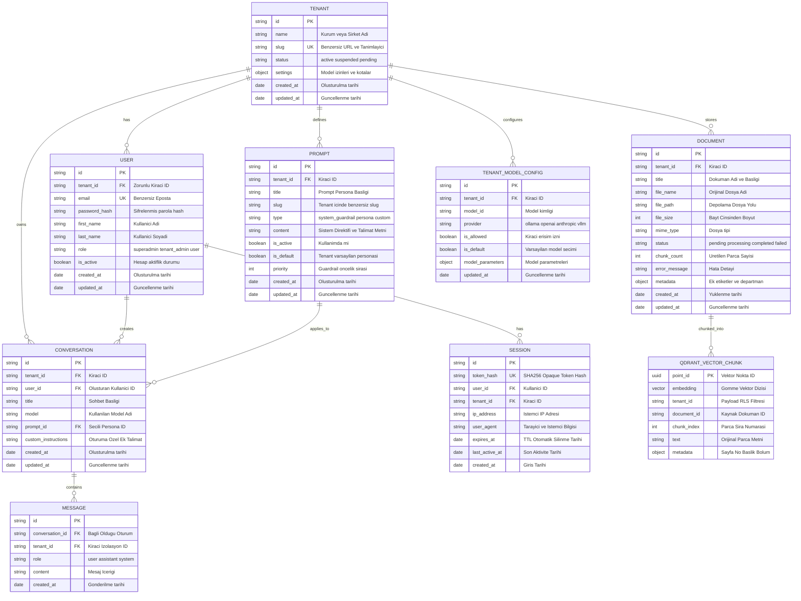
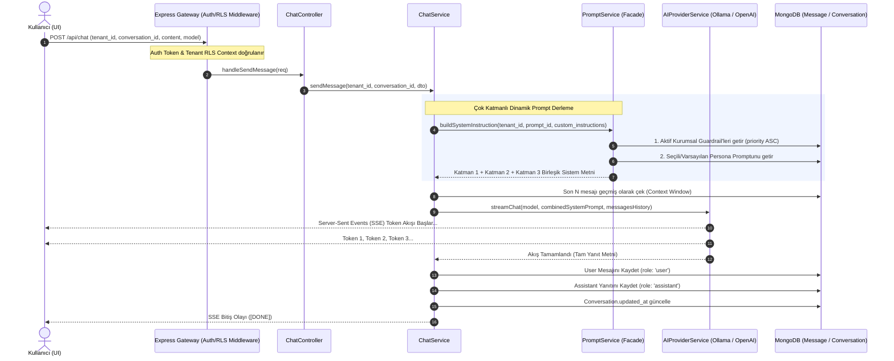
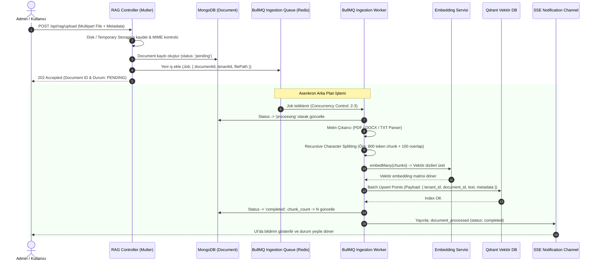
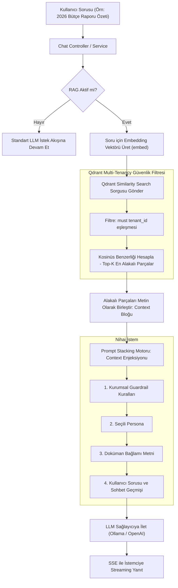
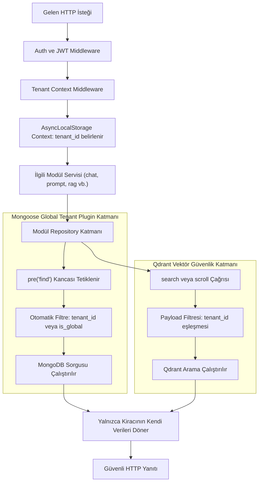

# VERİTABANI MİMARİSİ, VARLIK İLİŞKİLERİ (ERD) VE İŞ MANTIĞI ÇALIŞMA ŞEMALARI

> **DOKÜMAN TİPİ:** Ortak Veritabanı ve İş Akışları Referansı (Tüm Monorepo: `backend`, `admin-interface`, `user-interface`)  
> **Proje:** Kurumsal LLM & Veri Yönetim Platformu (_NexusAI Gateway & Knowledge Base_)  
> **Doküman:** Veritabanı ve İş Mantığı Çalışma Şemaları (Data & Business Architecture Specification)  
> **Sürüm:** v1.0.0  
> **Tarih:** Eylül 2026  
> **Hedef Kitle:** Yazılım Mimarları, Backend/Frontend Geliştiricileri ve AI Kodlama Ajanları

---

## 1. Giriş ve Hibrit Veri Mimarisi Vizyonu

Platform, kurumsal güvenlik ve yüksek ölçeklenebilirlik gereksinimlerini karşılamak amacıyla **3 katmanlı hibrit bir veri mimarisi** üzerine inşa edilmiştir:

1. **İlişkisel/Operasyonel Doküman Katmanı (MongoDB & Mongoose):**  
   Kiracılar (Tenants), kullanıcılar, roller, dinamik promptlar, sohbet geçmişi ve doküman üst verileri (metadataları) Mongoose şemaları altında tutulur. Tüm koleksiyonlarda **Row-Level Security (RLS)** esasıyla `tenant_id` mantıksal izolasyonu uygulanır.
2. **Vektörel Arama ve Bilgi Bankası Katmanı (Qdrant Dedicated Vector DB):**  
   RAG dokümanlarından elde edilen metin parçacıklarının (chunks) vektör gömmeleri (embeddings) Qdrant üzerinde saklanır. Çok kiracılı veri izolasyonu, Qdrant payload filtreleri üzerinden sağlanır.
3. **Asenkron İş Kuyruğu ve Dağıtık Durum Katmanı (BullMQ & Redis):**  
   Büyük dokümanların parçalanması, embedding çıkarımı, Ollama model indirmeleri ve API hız sınırlamaları Redis destekli BullMQ kuyrukları ile yönetilir.

---

## 2. Bütünleşik Varlık İlişkileri Şeması (Entity Relationship Diagram - ERD)

Aşağıdaki şemada, MongoDB üzerindeki temel koleksiyonlar, aralarındaki 1-N ve referans ilişkileri ile Qdrant vektör koleksiyonunun ilişkisi gösterilmiştir:



---

## 3. Koleksiyon Şemaları ve Veri Sözlüğü (Data Dictionary)

### 3.1. `tenants` (Kurumsal Kiracılar)

Sistemin en üst düzey izolasyon birimidir. Tüm veriler bir kiracıya aittir.

| Alan Adı                    | Tip           | Zorunlu? | Varsayılan | İndeks | Açıklama                                              |
| :-------------------------- | :------------ | :------: | :--------: | :----: | :---------------------------------------------------- |
| `_id`                       | ObjectId      |   Evet   |    auto    |   PK   | Kiracı benzersiz kimliği                              |
| `name`                      | String (100)  |   Evet   |     -      |   -    | Kurum ticari unvanı                                   |
| `slug`                      | String (50)   |   Evet   |     -      | UNIQUE | URL ve alt alan adı tanımlayıcısı                     |
| `status`                    | String        |   Evet   | `'active'` | Index  | `'active'`, `'suspended'`, `'pending'`                |
| `settings.allowed_models`   | Array[String] |   Evet   |    `[]`    |   -    | Admin tarafından kiracıya atanan izinli LLM modelleri |
| `settings.default_model`    | String        |  Hayır   |   `null`   |   -    | Oturumlarda varsayılan önerilecek model adı           |
| `settings.max_storage_mb`   | Number        |   Evet   |   `1024`   |   -    | Kiracının RAG doküman saklama kotası (MB)             |
| `created_at` / `updated_at` | Date          |   Evet   |    auto    |   -    | Zaman damgaları                                       |

---

### 3.2. `users` (Kullanıcılar ve RBAC)

Sistemde oturum açan personeller.

| Alan Adı        | Tip               | Zorunlu? | Varsayılan |             İndeks             | Açıklama                                   |
| :-------------- | :---------------- | :------: | :--------: | :----------------------------: | :----------------------------------------- |
| `_id`           | ObjectId          |   Evet   |    auto    |               PK               | Kullanıcı kimliği                          |
| `tenant_id`     | String / ObjectId |   Evet   |     -      |         Compound Index         | Bağlı olduğu kurum                         |
| `email`         | String            |   Evet   |     -      | UNIQUE (`email` + `tenant_id`) | E-posta adresi                             |
| `password_hash` | String            |   Evet   |     -      |               -                | Şifrelenmiş parola özeti                   |
| `first_name`    | String            |   Evet   |     -      |               -                | Adı                                        |
| `last_name`     | String            |   Evet   |     -      |               -                | Soyadı                                     |
| `role`          | String            |   Evet   |  `'user'`  |             Index              | `'superadmin'`, `'tenant_admin'`, `'user'` |
| `is_active`     | Boolean           |   Evet   |   `true`   |             Index              | Hesap aktiflik durumu                      |

---

### 3.2.1. `sessions` (Kullanıcı Oturumları & Opaque Bearer Tokens)

Kullanıcıların aktif oturumlarını ve anlık ban/yetki iptalini yöneten veritabanı oturum koleksiyonu.

| Alan Adı         | Tip               | Zorunlu? | Varsayılan | İndeks                     | Açıklama                                                       |
| :--------------- | :---------------- | :------: | :--------: | :------------------------- | :------------------------------------------------------------- |
| `_id`            | ObjectId          |   Evet   |    auto    | PK                         | Oturum benzersiz kimliği                                       |
| `token_hash`     | String (64 hex)   |   Evet   |     -      | UNIQUE                     | Opaque Bearer Token'ın SHA-256 kriptografik özeti              |
| `user_id`        | ObjectId          |   Evet   |     -      | Compound (`user_id`, `tenant_id`) | Oturumu açan kullanıcı kimliği                                |
| `tenant_id`      | String            |   Evet   |     -      | Index                      | Kiracı kimliği                                                 |
| `ip_address`     | String            |  Hayır   |     -      | -                          | Oturum açılan istemci IP adresi                                |
| `user_agent`     | String            |  Hayır   |     -      | -                          | İstemci tarayıcı ve platform başlığı                           |
| `expires_at`     | Date              |   Evet   |   +7 gün   | TTL Index (`expireAfterSeconds: 0`) | Süresi dolan oturumları MongoDB otomatik siler                 |
| `last_active_at` | Date              |   Evet   |    auto    | -                          | Son HTTP isteği zaman damgası (Anlık aktivite takibi)          |
| `created_at`     | Date              |   Evet   |    auto    | -                          | Oturum başlangıç zamanı                                        |

---

### 3.3. `prompts` (Dinamik Prompt Stacking Motoru)

Promptlar artık oturum içine gömülü statik metinler değildir. 3 farklı tipte dinamik derlenir:

| Alan Adı     | Tip          | Zorunlu? | Varsayılan  |                    İndeks                     | Açıklama                                           |
| :----------- | :----------- | :------: | :---------: | :-------------------------------------------: | :------------------------------------------------- |
| `_id`        | ObjectId     |   Evet   |    auto     |                      PK                       | Prompt kimliği                                     |
| `tenant_id`  | String       |   Evet   |      -      |                Compound Index                 | Kiracı kimliği                                     |
| `title`      | String (150) |   Evet   |      -      |                       -                       | Başlık (Örn: "KVKK & Finansal Güvenlik Guardrail") |
| `slug`       | String       |   Evet   |      -      |        Compound (`tenant_id` + `slug`)        | Kod içi ve API erişim slug'ı                       |
| `type`       | String       |   Evet   | `'persona'` | Compound (`tenant_id` + `type` + `is_active`) | `'system_guardrail'`, `'persona'`, `'custom'`      |
| `content`    | String       |   Evet   |      -      |                       -                       | LLM'e enjekte edilecek gerçek talimat              |
| `is_active`  | Boolean      |   Evet   |   `true`    |                     Index                     | Aktiflik anahtarı                                  |
| `is_default` | Boolean      |   Evet   |   `false`   |                       -                       | Tenant için varsayılan persona mı?                 |
| `priority`   | Number       |   Evet   |     `0`     |                       -                       | Guardrail birleştirme öncelik sırası               |

---

### 3.4. `conversations` (Sohbet Oturumları)

| Alan Adı              | Tip           | Zorunlu? |   Varsayılan    |                İndeks                 | Açıklama                                               |
| :-------------------- | :------------ | :------: | :-------------: | :-----------------------------------: | :----------------------------------------------------- |
| `_id`                 | ObjectId      |   Evet   |      auto       |                  PK                   | Oturum kimliği                                         |
| `tenant_id`           | String        |   Evet   |        -        | Compound (`tenant_id` + `updated_at`) | RLS İzolasyon anahtarı                                 |
| `title`               | String (200)  |   Evet   | `'Yeni Sohbet'` |                   -                   | Sohbet başlığı                                         |
| `model`               | String        |   Evet   |        -        |                   -                   | Zorunlu seçilen LLM adı (Hardcode yasaktır!)           |
| `prompt_id`           | ObjectId      |  Hayır   |     `null`      |                 Index                 | Bağlı olunan Persona (`prompts` koleksiyonu referansı) |
| `custom_instructions` | String (2000) |  Hayır   |     `null`      |                   -                   | Kullanıcının bu oturuma özel eklediği yönergeler       |

---

### 3.5. `messages` (Sohbet Mesajları)

| Alan Adı          | Tip      | Zorunlu? | Varsayılan |                   İndeks                    | Açıklama                                |
| :---------------- | :------- | :------: | :--------: | :-----------------------------------------: | :-------------------------------------- |
| `_id`             | ObjectId |   Evet   |    auto    |                     PK                      | Mesaj kimliği                           |
| `conversation_id` | ObjectId |   Evet   |     -      | Compound (`conversation_id` + `created_at`) | Bağlı olduğu oturum                     |
| `tenant_id`       | String   |   Evet   |     -      | Compound (`tenant_id` + `conversation_id`)  | Çift katmanlı RLS kontrolü              |
| `role`            | String   |   Evet   |     -      |                      -                      | `'user'`, `'assistant'`, `'system'`     |
| `content`         | String   |   Evet   |     -      |                      -                      | Mesaj içeriği (Markdown destekli metin) |
| `created_at`      | Date     |   Evet   |    auto    |                      -                      | Mesaj zaman damgası                     |

---

### 3.6. `documents` (RAG Bilgi Bankası Üst Verileri)

| Alan Adı        | Tip      | Zorunlu? | Varsayılan  |              İndeks               | Açıklama                                               |
| :-------------- | :------- | :------: | :---------: | :-------------------------------: | :----------------------------------------------------- |
| `_id`           | ObjectId |   Evet   |    auto     |                PK                 | Doküman kimliği                                        |
| `tenant_id`     | String   |   Evet   |      -      | Compound (`tenant_id` + `status`) | Kiracı izolasyon anahtarı                              |
| `title`         | String   |   Evet   |      -      |                 -                 | Doküman başlığı                                        |
| `file_name`     | String   |   Evet   |      -      |                 -                 | Orijinal dosya adı                                     |
| `file_path`     | String   |   Evet   |      -      |                 -                 | Sunucu yerel depolama dosya yolu                       |
| `file_size`     | Number   |   Evet   |      -      |                 -                 | Bayt cinsinden boyut                                   |
| `mime_type`     | String   |   Evet   |      -      |                 -                 | `application/pdf`, `text/markdown` vb.                 |
| `status`        | String   |   Evet   | `'pending'` |               Index               | `'pending'`, `'processing'`, `'completed'`, `'failed'` |
| `chunk_count`   | Number   |   Evet   |     `0`     |                 -                 | Qdrant'a yazılan vektör parçası adedi                  |
| `error_message` | String   |  Hayır   |   `null`    |                 -                 | Başarısızlık durumunda hata logu                       |

---

### 3.7. Qdrant Vektör Koleksiyonu Şeması (`rag_documents_vectors`)

Qdrant üzerinde her vektör kaydı bir `Point` nesnesidir:

- **Point ID:** UUIDv4 formatında benzersiz parça kimliği.
- **Vector:** Model embedding çıktısı (örn: 1536 float değerleri).
- **Payload (Filtrelenebilir Meta Veri):**
  ```json
  {
    "tenant_id": "tenant_123",
    "document_id": "66f91a2b...",
    "chunk_index": 4,
    "text": "Kurumumuz bünyesinde veri güvenliği...",
    "metadata": {
      "filename": "guvenlik_kilavuzu.pdf",
      "page_number": 12,
      "section": "Gizlilik Prensipleri"
    }
  }
  ```

---

## 4. İş Mantığı ve Çalışma Akış Şemaları (Workflows & Sequences)

### 4.1. Akış 1: LLM Mesaj Gönderimi & Dinamik Prompt Stacking Akışı

Kullanıcı bir mesaj gönderdiğinde sistemin yanıt üretme, güvenlik guardrail'lerini uygulama ve veritabanına yazma sırası:



---

### 4.2. Akış 2: RAG Doküman Yükleme ve Asenkron İşleme Pipeline'ı (Ingestion)

Yüksek boyutlu kurumsal dokümanların ana HTTP thread'ini bloke etmeden BullMQ worker'ları ve Qdrant ile işlenmesi:



---

### 4.3. Akış 3: RAG Destekli Chat Arama ve Yanıt Üretimi (Retrieval Flow)

Kullanıcı RAG aramasını aktif ederek bir soru sorduğunda Qdrant ve LLM entegrasyonu:



---

### 4.4. Akış 4: Multi-Tenant Row-Level Security (RLS) Karar Akışı

Gelen her isteğin yetkisiz kiracıların verilerine erişmesini engelleyen güvenlik akışı:



---

## 5. Modüler Monolit Facade ve İletişim Standartları

[AGENTS.md](../../AGENTS.md) 3. kuralı uyarınca: **Modüller birbirlerinin veritabanı modellerini doğrudan import edemez.** Modüller arası tüm etkileşim yalnızca modülün kökündeki `index.ts` üzerinden yürütülür.

### Modül İletişim Arayüzleri Tablosu

| İsteyen Modül | Hedef Modül | İzin Verilen Facade Metodu / Event                                              | Gerekçe / Kullanım Amacı                                       |
| :------------ | :---------- | :------------------------------------------------------------------------------ | :------------------------------------------------------------- |
| `chat`        | `prompt`    | `promptService.buildSystemInstruction(tenantId, promptId, custom)`              | Çok katmanlı promptu anlık derlemek                            |
| `chat`        | `auth`      | `authService.validateUser(userId, tenantId)`                                    | Kullanıcının aktifliğini ve kiracı yetkisini denetlemek        |
| `chat`        | `ai`        | `aiProviderService.streamText(model, prompt, messages)`                         | LLM çıkarımını başlatmak                                       |
| `chat`        | `rag`       | `ragService.queryContext(tenantId, query, topK)`                                | RAG destekli sohbette benzer doküman parçalarını getirmek      |
| `rag`         | `ai`        | `aiProviderService.embedMany(texts)`                                            | Chunk parçaları için embedding vektörleri üretmek              |
| `tenant`      | `prompt`    | `Event: tenant.created` $\rightarrow$ `promptService.createDefaultPrompts()`    | Yeni kurum açıldığında varsayılan persona ve kuralları üretmek |
| `tenant`      | `chat`      | `Event: tenant.suspended` $\rightarrow$ `chatService.terminateActiveSessions()` | Kurum askıya alındığında aktif bağlantıları kesmek             |

---

## 6. Özet ve Uygulama Kontrol Listesi

- [x] **MongoDB Şemaları:** `Tenant`, `User`, `Prompt`, `Conversation`, `Message`, `Document` ilişkileri ve indeksleri tanımlandı.
- [x] **Dinamik Prompt Stacking:** 3 katmanlı derleme sırası (Guardrail $\rightarrow$ Persona $\rightarrow$ Custom) şemalaştırıldı.
- [x] **Qdrant Vektör İzolasyonu:** Vektör payload şeması ve `tenant_id` filtresi netleştirildi.
- [x] **RAG Pipeline:** BullMQ eşzamanlı çalışma, Redis ve SSE ilerleme akışları bağlandı.
- [x] **Modüler Monolit İzolasyonu:** Modüller arası Facade sözlüğü ve cross-DB import yasağı dokümante edildi.
